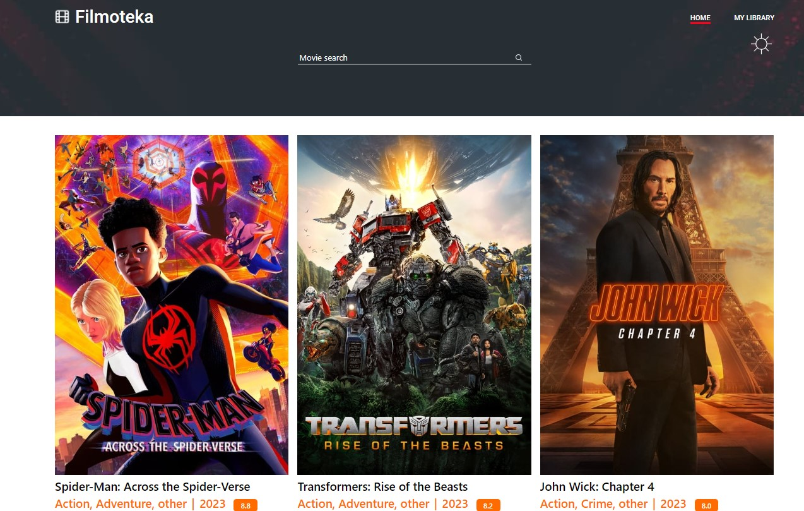
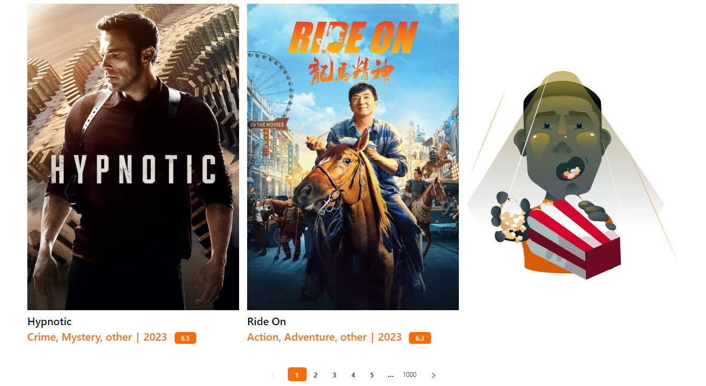
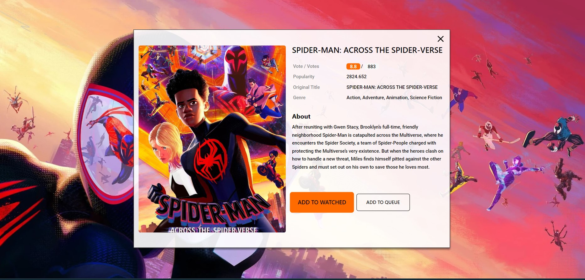
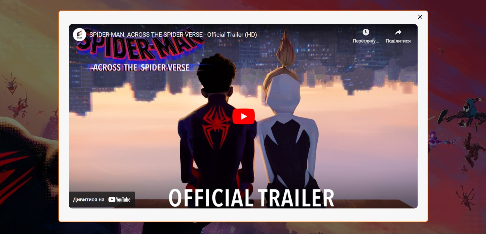
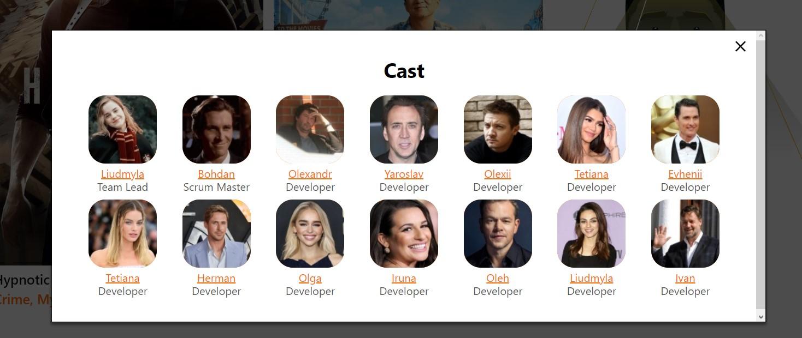
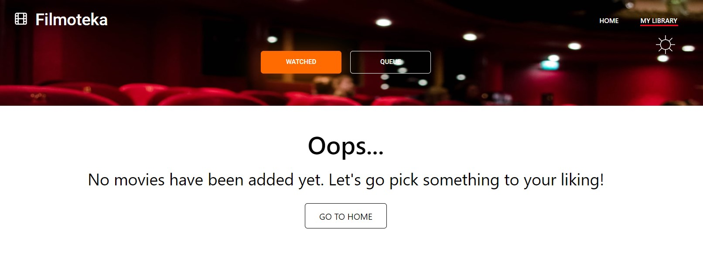

# Filmoteka

Filmoteka is adaptive movie database website that provides any user with a
convenient and frugal way to find information about favorite films right from
the comfort of user's own home. It includes two pages - main page and library.

The project was develloped by the **'Cast'** team.  
Team leader: <a href="https://github.com/Milosska">Liudmyla Deinychenko</a>  
Scrum master: <a href="https://github.com/Pibodee">Bogdan Salo</a> (Footer
modal, Movie traler modal)

Developers:

- <a href="https://github.com/TaniaShmigel">Tetiana Shmigel</a> - Header section
- <a href="https://github.com/Yaroslav12002">Yaroslav Mychailov</a> - Movie
  card, Handlebars template, GSAP animation
- <a href="https://github.com/IrynaVal">Iryna Petrenko</a> - Movie list, Watched
  and Queue lists
- <a href="https://github.com/Olga-Melnyk">Olga Melnyk</a> - API services,
  themes change
- <a href="https://github.com/Luidmyla007">Liudmyla Datsenko</a> - Movie modal
- <a href="https://github.com/Tatiana1910">Tetiana Kramarenko</a> - Movie modal
- <a href="https://github.com/Oleh202208">Oleh Polupan</a> - Films search
- <a href="https://github.com/AlexGusl97">Oleksandr Husliakov</a> - Modal movie
  info
- <a href="https://github.com/Demianovq">Herman Demianov</a> - Pagination
- <a href="https://github.com/IvanSosnin1983">Ivan Sosnin</a> - Watched and
  Queue lists
- <a href="https://github.com/ChornyiYevhenii">Evhenii Chornyi</a> - Modal
  Watched and Queue buttons functional (with local storage)
- <a href="https://github.com/AlexeyVorobyov95">Alexey Vorobyov</a> - API
  services

---

## Main page

This page gives user the opportunity to get acquainted with the list of popular
movies of today.

### Header

The header section includes website's logo, site navigation, theme change button
and search query, that allows user to find the film of his/her interest.

### Main

Main section is presented by the list of popular movies. Each movie card
includes title, poster, genres info, release year and rationg of the movie.  
At the end of the section user can find pagiantion that alows to easily switch
pages, and interactive animation that will make even the most demanding user
smile.

### Modal

By click on any movie card user can open a modal window with additional
information on the film. The backbrop of the modal is presented by movie poster,
which catches interest of the user and allows to see some new movie details.

  
In the end of the modal window user can find tow buttons, that allow to add
current movie to the library (to the list of watched films or to the queue
accordingly).  
By clicking on the movie poster user can also watch a movie trailer.

### Footer

The footer section includes interactive link, that opens modal window with the
list of **Cast team** members.

---

## Library page

This page allows user to keep two presonal movie lists - one for watched movies,
another - for the queue.

---

## Technology stack

Project was build using indicated tech stack:

	<code></code>
	<code></code>
	<code></code>
	<code></code>
	<code></code>
	<code></code><code></code>
 	<code></code>
		<code></code>
	<code>

